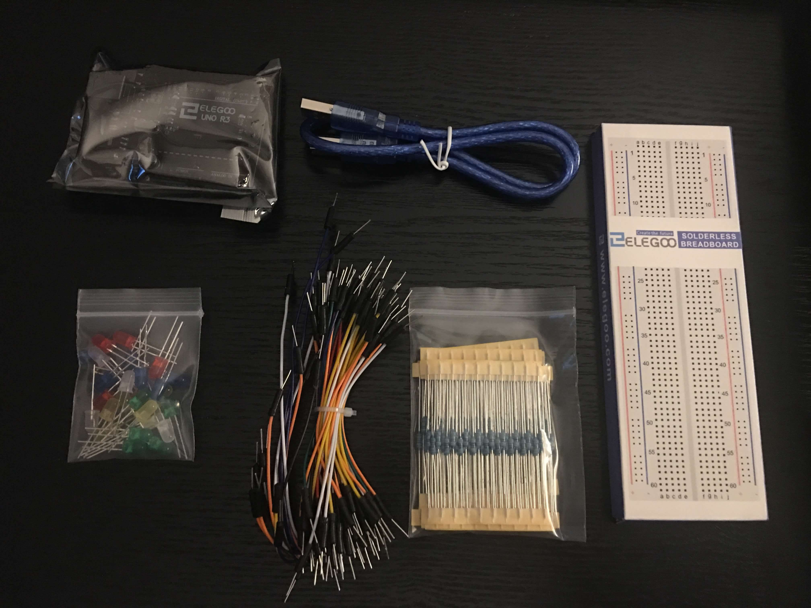
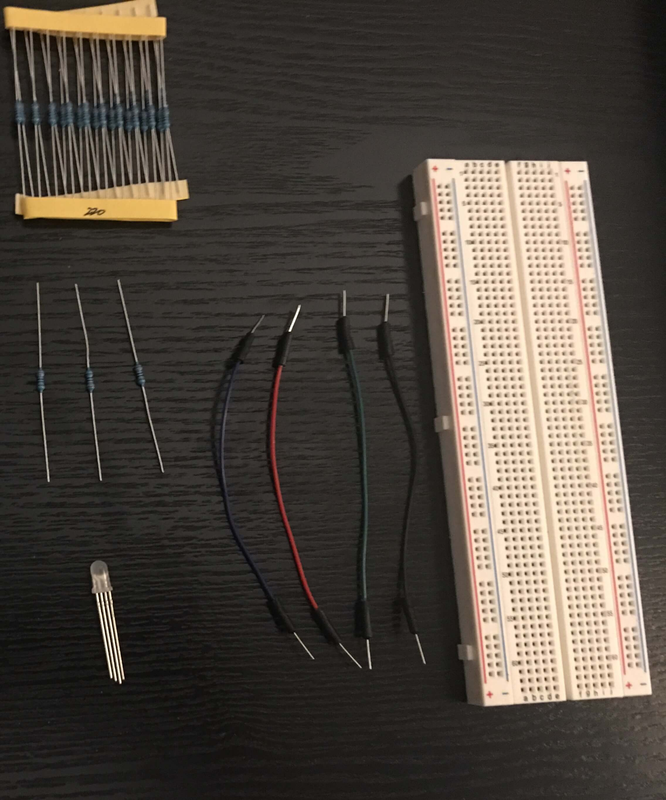
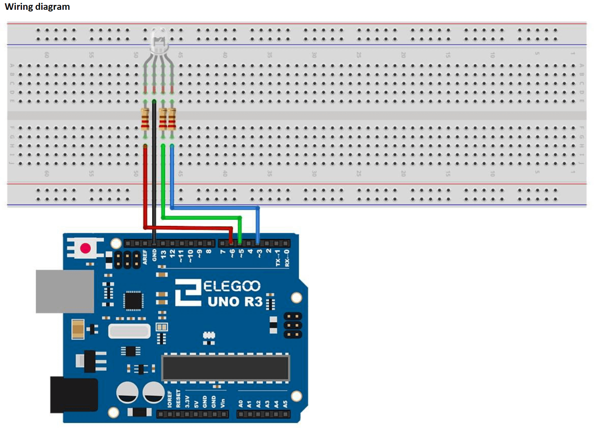
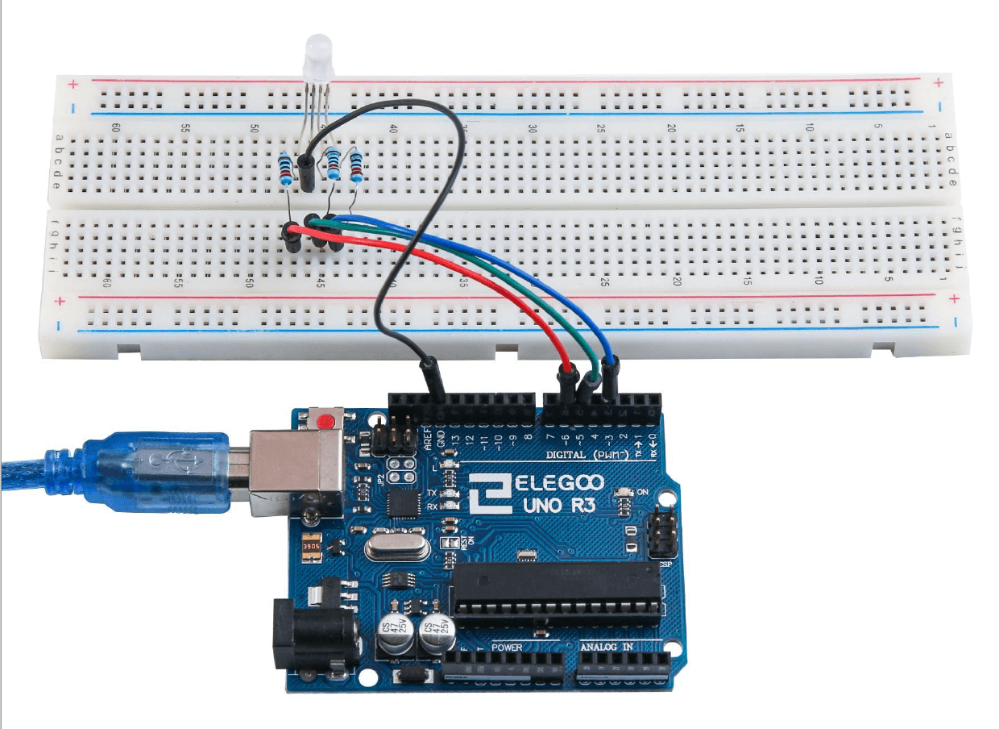
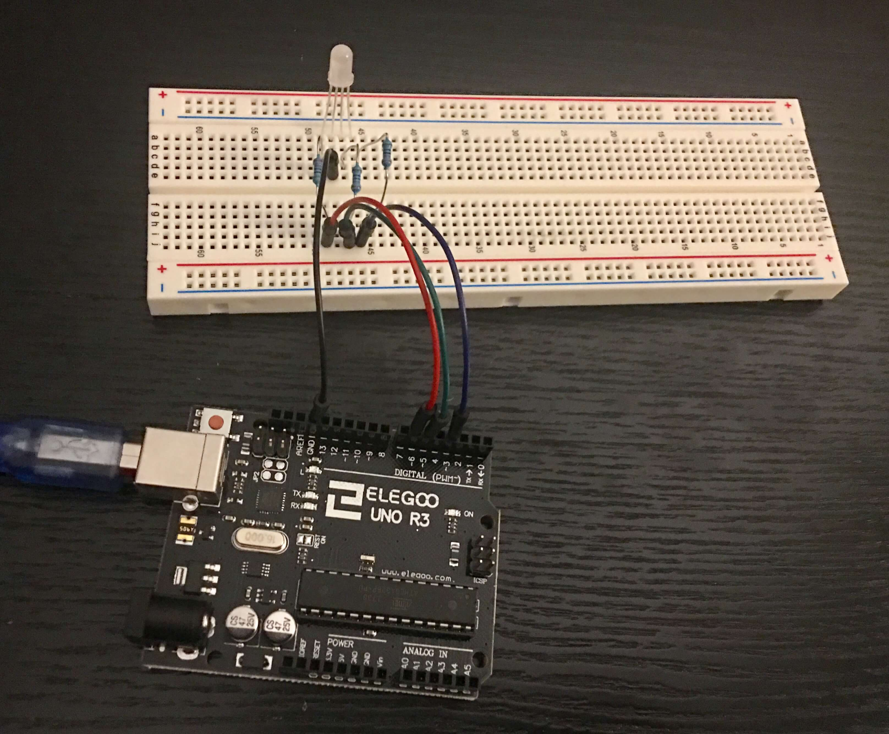
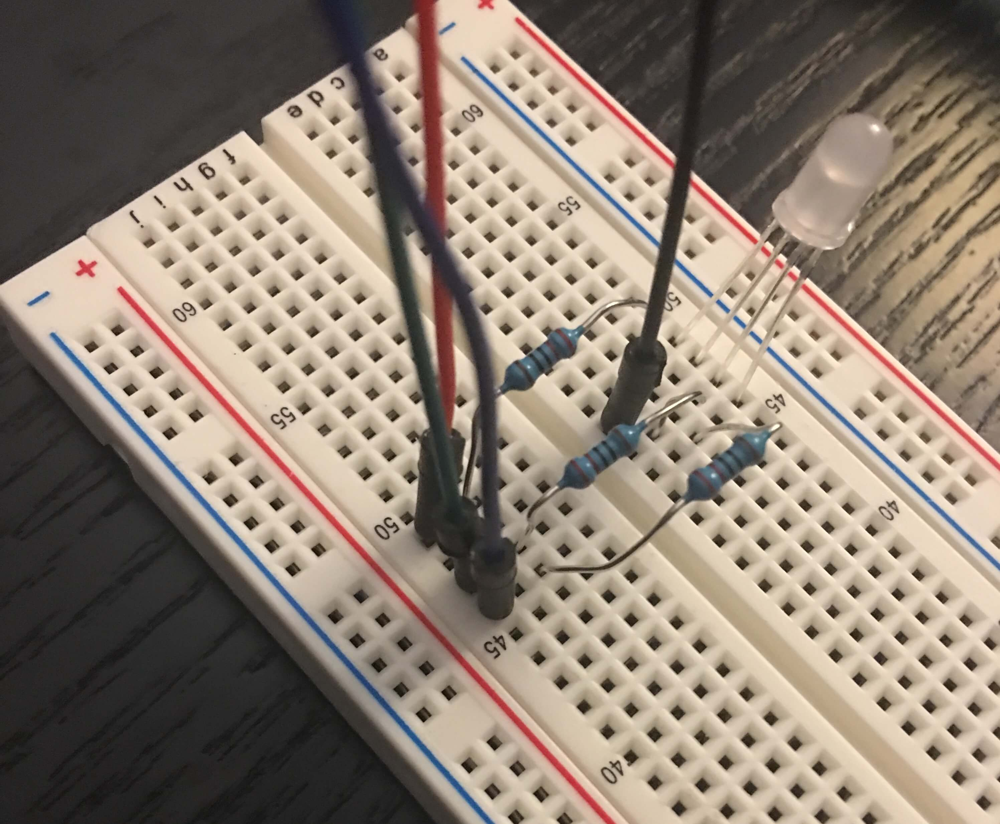

# Let it glow
*This repo name (let it go) is either a tribute to [Indiana Jones](https://youtu.be/PAfZ7V2VyD8?t=106) or [Frozen](https://www.youtube.com/watch?v=moSFlvxnbgk&feature=youtu.be&t=60) - you decide.*

## Intro to an Arduino project (using Elegoo Super Starter Kit)

### Setup
  1. [Download Arduino IDE](https://www.elegoo.com/pages/arduino-kits-support-files)
      - Expand the Arduino IDE section and select the correct download for your OS
  
  1. [Download Elegoo Super Starter Kit Tutorial](http://69.195.111.207/tutorial-download/?t=UNO_R3_Project_Super_Starter_Kit)
  1. Install the IDE
  
  *If downloads are taking awhile, you can go ahead and start [assembling your project](https://github.com/marydavis/let-it-glow#the-project-begins), but don't forget to come back here once it has finished.*

### Let's make sure the board works first
  1. Take the Elegoo Uno R3 board out of bottom left section. *(I keep my antistatic bag for storage)*
  1. Take the blue USB cable out of the top section.
  1. Plug your board into your computer using the cable.
  1. Your board should have a green light and an orange light on it. The green light should be solid; the orange light may be solid or blinking.
  1. Open the Arduiono IDE.
  1. Confirm board setup, click `Tools` in the top toolbar which should include the below:
      * `Board: Arduino/Genuino Uno` - if not, select it from the list.
      * `Port: Arduino/Genuino Uno` - if not, select it from the list (find the one that contains 'Arduino/Genuino Uno', don't worry if it has other text too).
 
  1. Next, in the File menu open the Blink example: `File -> Examples -> 01.Basics -> Blink`.
      * When uploaded this example code will make your orange light on your board flash every 1 second.
  1. Upload this code to your board by clicking Upload.
      * Click the ➡️(right arrow) for Upload, it is next to the check mark above the "Blink" tab name.
  1. You should see it sending information in the console at the bottom of the screen and several lights flashing on your board.
  1. Now you should see the orange light on your board flashing every 1 second. 
  
  **If so, your board and setup works! Yay, you are ready for the project!**

## The Project Begins
*(this project starts from a tutorial for easier setup)*

### Parts List 
*(everything except the board can be found in the top compartment of the kit)*

  1. **Arduino board** - Elegoo Uno R3
  1. **USB cable** - for connecting board to computer
  1. **Breadboard** - great way to try things out, not permanent, no soldering
  1. **1 RGB LED** - clear LED with 4 metal prongs (legs)
  1. **4 M-M wires (male to male)** - one for each leg of LED
  1. **3 x 220ohm resistors** - prevents too much power going to LED, which would burn out without them *(the stripes are important, they are used to show the value of ohms. Here is a neat [color code calculator](https://www.allaboutcircuits.com/tools/resistor-color-code-calculator/).
     * Don't worry if you bend the resistors getting them out of their packaging, you will be bending them alot more shortly :)
     * **The ohm number is written on the paper holding the resistors - make sure it says 220 (see image below for example)**

  #### Images of Parts
  This is what all the parts look like in their original packaging.

  All Packaged Parts:

  

  This is what the parts look like removed from packaging.

  Unpackaged New Parts:

  

### Instructions
  1. Let's start plugging things into the breadboard.
    * **Make sure to unplug your Arduino, we don't want any power going to it while we are plugging things in.**

  1. Diagram and pictures are included below to be used along with instructions.
  1. First plug in the RGB LED - each leg in a different hole in the breadboard in a column, ex. column "b"
      * The longest leg is the GROUND
      * The legs are as following: RED, GROUND, GREEN, BLUE
  1. Next are resistors, one for each color (skipping the ground)
      * Remember these limit the amount of power going to your LED to prevent it from burning out.
      * Resitors will cross the channel (the cut out between column "e" and "f").
      * Power does not cross the channel, this allows us to plug in the power on one side of the channel and the LED on the other side making the resistor connect the two.
      * Plug one metal end into the same row as the leg on one side of the channel and then in the same row on the other side of the channel.

  1. Now for the wires
      * Remember these are for connecting the power from the Arduino board.
      * I used wires that matched the color lights, but any color will do.
      * Use 1 wire for each leg.
      * All wires except for the ground will be on the otherside of the channel away from the LED.
  1. Plug the ground wire into the Arduino black hole labelled `GND`, then into the hole in the breadboard that doesn't have a resistor near the LED.
      * Remember you can use the diagram and pictures below.
  1. The red wire is plugged into the Arduino board `~6` then into the row of the red leg. 
      * Remember this is power and must be across the channel away from the LED
      * The numbers of where they are plugged in are used in the code so make sure they are right.
      * The `~` before the number means it is a PWM (Pulse-width modulation) pin - meaning we can program the power going to it through our code.
  1. The green wire is plugged into the Arduino board `~5` then into the row of the red leg. 
  1. The blue wire is plugged into the Arduino board `~3` then into the row of the red leg.

  **MAKE SURE NONE OF THE RESISTORS ARE TOUCHING EACH OTHER**

  #### Diagram and Pictures
  Elegoo Diagram:

  

  Elegoo picture:

  

  Wire Overview:

  

  Wire Closeup:

  

  #### Upload the Code

  1. Open Elegoo Super Starter Kit Tutorial Folder *(downloaded in setup)*
      *  *For more detailed information and schematics, checkout the tutorial by opening the Elegoo Super Starter Kit Tutorial pdf and going to Lesson 4 (pg 47)*

  1. Open English folder -> Code folder -> Lesson 4 folder -> Open `.ino` file in IDE
      * As you can see, the code is simplified C++ and commented throughout explaining each section.
  1. Plug your Arduino into your computer so we can upload the code and supply power to the board (for now).
  1. Upload this code to your board by clicking Upload.
  1. Your light should now be changing colors!

  #### Freedom!
  Currently your computer is powering your Arduino, so it stops as soon as it is unplugged.
  We are going to fix that!
  1. Find the 9volt battery and wire that connects to it.
  2. It is as simple as plugging it into the board.
  3. Voila! Now your arduino can run on its own and only needs the computer to upload code changes if desired.

 #### Next Steps
  1. Make changes to the code for different colors or timing and "save as" your own file.
  1. Compile the code by clicking the "checkmark".
  1. Upload this code to your board by clicking Upload.
  1. See your changes go live!

### Tips
  * Get an antistatic box for projects in progress - makes it easier to store.
  * Get an antistatic mat - helps prevent board death.

### Ready for More (some ideas)
*The Elegoo Super Starter Kit Tutorial pdf includes many other tutorials, give them a try!*
  1. Add button to turn on/off.
  1. Add the humidity/thermometer and make code to change the lights depending on levels.
  1. Add a lamp shade for a pretty light.

## Awesome Places for Fun Projects

[Hackster.io](https://www.hackster.io/)

[Arduino Project Hub](https://create.arduino.cc/projecthub)

[hackaday.io](https://hackaday.io/list/3611-arduino-projects)

## Help make this better
  Please submit a Pull Request for any recommended changes you find along the way :)
